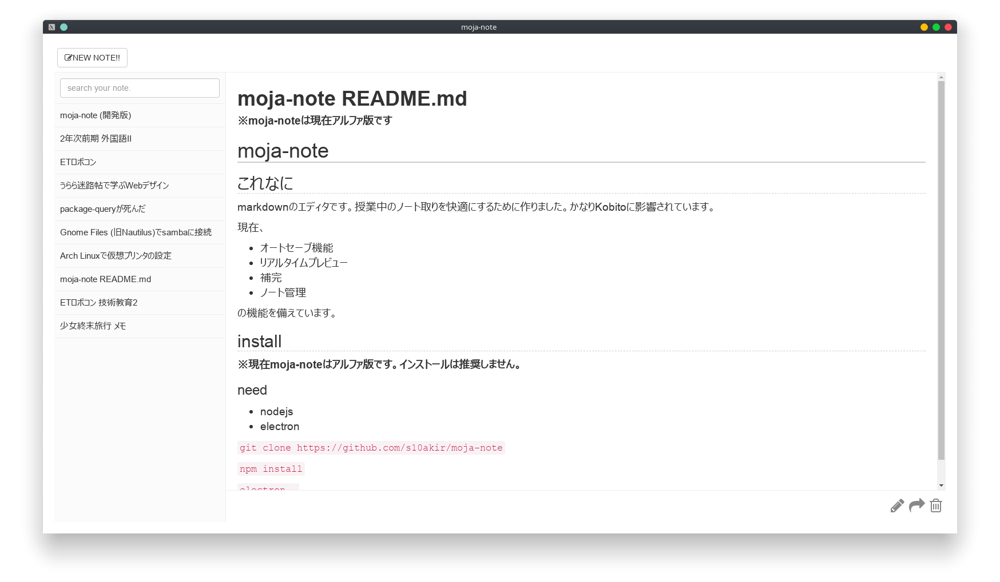
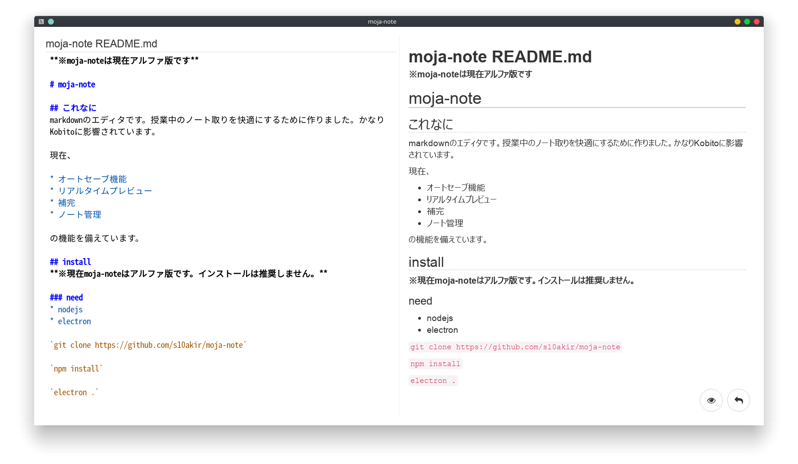

# Hello World!

## who am I
Date of birth: 1998.10.02

日本工学院専門学校ITカレッジITスペシャリスト科システム系統に在学しています。  

### 開発環境

|OS    |ArchLinux         |
|Editor|vim               |
|IDE   |各種JetBrains製IDE|

### 資格

|2017.03|ITパスポート試験                               |
|2017.09|Microsoft Office Specialist Word 2013          |
|2017.11|基本情報技術者試験                             |
|2018.02|Microsoft Office Specialist Excel 2013         |
|2018.06|応用情報技術者試験                             |
|2018.12|情報処理安全確保支援士試験                     |
|2019.04|情報処理安全確保支援士 取得 （登録番号 018283）|

---

## 得意分野
### Linux
物心ついた頃からLinuxをメイン環境として使用しています。  
Ubuntuから入り様々なディストリビューションに触れましたが、現在ArchLinuxに落ち着きました。

個人所有のサーバを運営しており、Linuxサーバの運用経験があります。

将来の夢は立派なシェル芸人になることです。

### Ruby
最も長く触っている言語です。  
特別な理由がない場合は基本Rubyで開発することが多いです。

### Node.js
GUIアプリケーションを開発する際にNode.js + Electronをよく利用します。  
最近はWebアプリケーションや競プロにもJSで挑戦しています。

### C++
組み込み開発の分野でしか触ったことがないので汎用的なアプリケーションへの知見は不足気味ですが、ロボコンに参加した際にC++で開発しました。

### Python3
ライブラリが豊富なため、こちらで開発することも多々あります。

### Java
あまり好みではないので個人での開発にはほぼ使用しませんが、利用歴が長いため得意です。

### Web
アルバイトを通して多くのWebアプリケーションフレームワークに触れました。  
Rails, Django, Laravel, Flask, Expressであれば一般的なWebアプリケーションを構築できます。

---

## 制作物
### [moja-note](https://github.com/s10akir/moja-note)

現在制作中のマークダウンエディタです。  
Node.js + Electronで開発しています。

授業ノートを取ることに特化したアプリケーションという目的で作成しました。  
自動保存なので"ノートを取る"以外の余計なことを意識しなくてよいと言うところが売りです。  
クラスメートに共有し、ノートアプリとして利用できる段階まできていますがまだまだ課題を抱えています。

以前に比べ技術力が向上したため、このアプリケーションは開発を終了しリビルドすることになりました。  
現在Electron + Reactで開発中です。

### [mojaproxy](https://github.com/s10akir/mojaproxy)
小物の例です。
単純なプロキシスイッチャのスクリプトです。  
自宅と学校でプロキシの有無が違うので、一々環境変数を書き換えるのが面倒で作成しました。

怠惰な性格なのでこういったちょっとしたスクリプトで日々を効率化しています。

### [Logging](https://github.com/s10akir/Logging)
Kotlinで開発したマインクラフトサーバ用のいわゆる一括破壊Modです。  
正直マインクラフトをしているよりマインクラフトのModを作っている方が楽しいことに気づいてしまいました。

---

## その他
### 趣味
#### キーボード
かなりこだわりを持っていて、海外からパーツを取り寄せて自作したり、既成品を改造したりしています。  
週1でキーボードが変わったりします。

現在のお気に入りはMajestouch MINILA Air（黒軸）。  
一部スイッチを別の軸へ換装したり、輸入したブランクキーキャップでカスタムしています。

HHKB Pro2 無刻印 墨も愛用しています。

#### 機械いじり
電子工作など得意です。  
しょっちゅう壊れたスマホやPCをジャンク屋から拾ってきては修理して自己満足に浸っています。

#### 楽器
中学の頃、クラシックギター部に所属していました。  
アコースティック楽器の音色が好きで今でも時々気分を変えたいときに弾いています。

#### イラスト
絵を書くのが小さい頃からの趣味です。  
プロフィールアイコンなどを自分で書いています。

#### アニメ
少女終末旅行が非常によかった。とてもよかった。  
ご注文はうさぎですか？3期を死ぬまで待ち続けています。 -> 来ました これで死ねる

